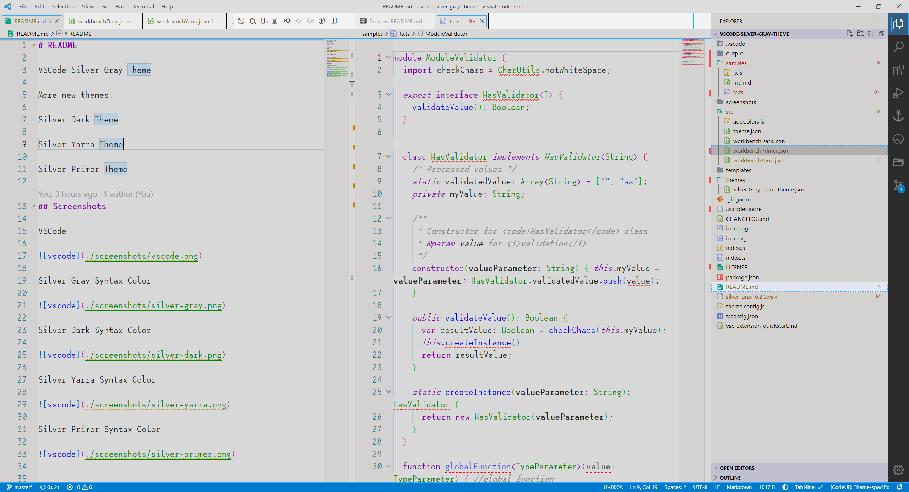
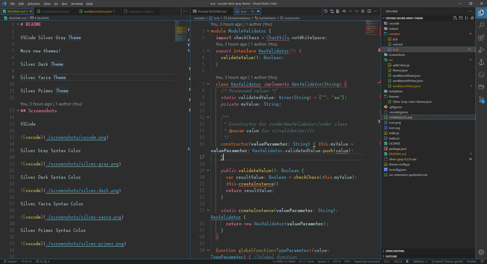
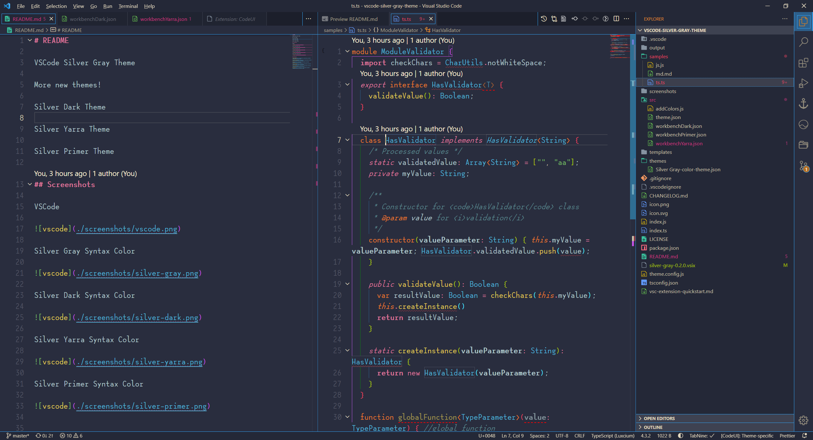
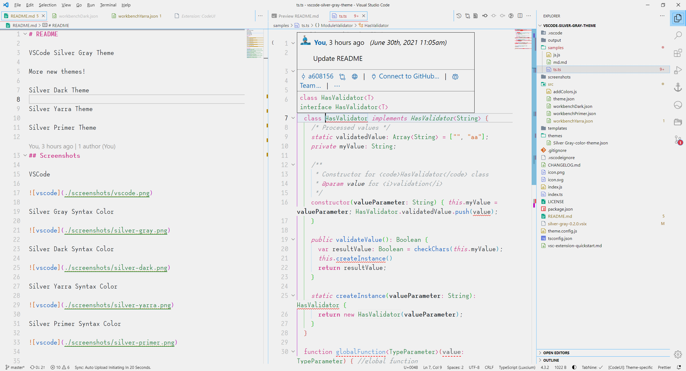
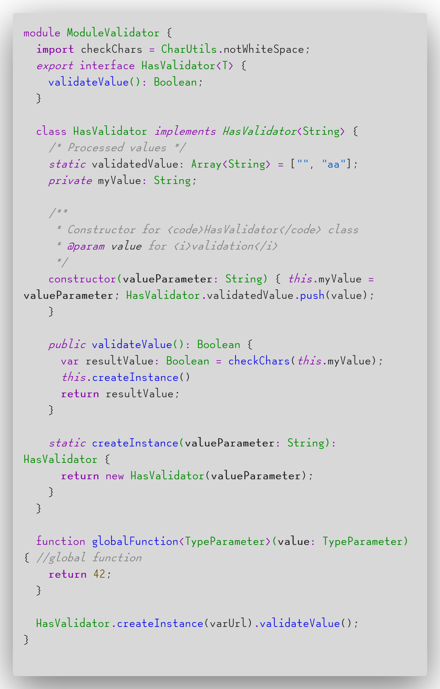
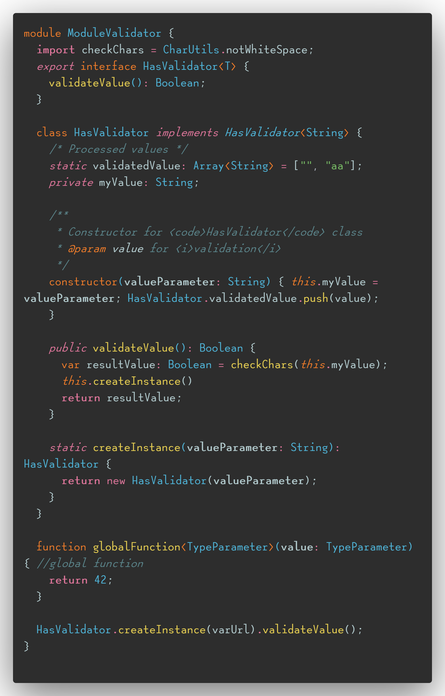
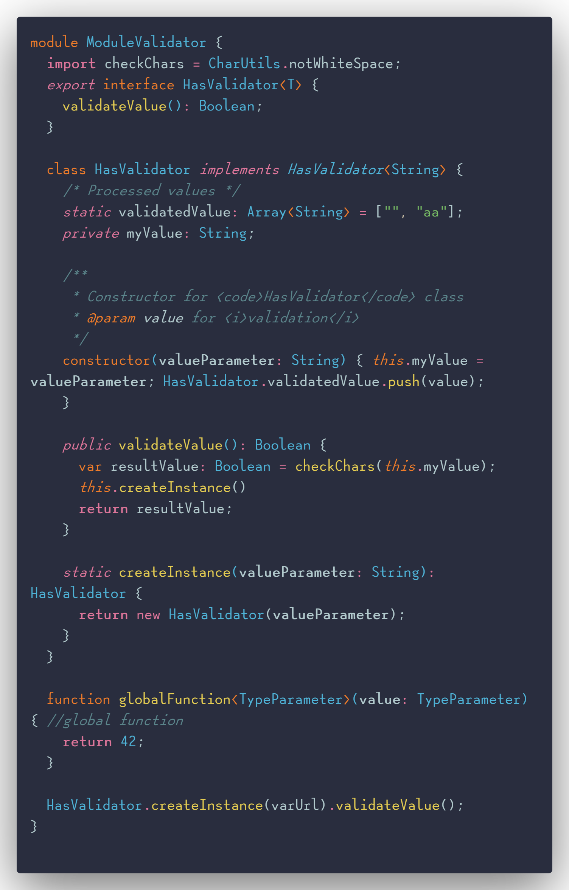
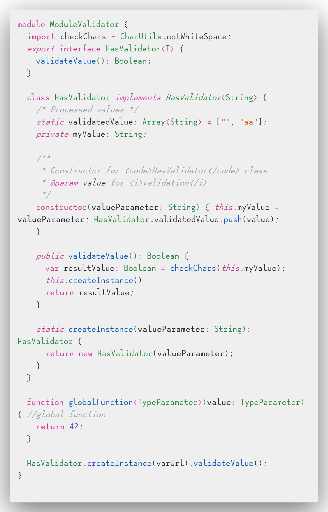

# README

VSCode Silver Gray Theme

More new themes!

Silver Dark Theme

Silver Yarra Theme

Silver Primer Theme

## Screenshots

Silver Gray Theme

> References: [Noctis], [Gray Gray Gray], [Tokyo Night]

Silver Dark Theme

> References: [Noctis], [An Old Hope], [New Moon]

Silver Yarra Theme

> References: [Noctis], [An Old Hope], [Yarra Valley]

Silver Primer Theme

> References: [Noctis], [Github Theme], [Github Light]

Silver Gray Syntax Color

Silver Dark Syntax Color

Silver Yarra Syntax Color

Silver Primer Syntax Color

## References

[Noctis](https://marketplace.visualstudio.com/items?itemName=liviuschera.noctis)

[Tokyo Night](https://marketplace.visualstudio.com/items?itemName=enkia.tokyo-night)

[Gray Gray Gray](https://marketplace.visualstudio.com/items?itemName=kendama1980.graygraygray)

[Github Theme](https://marketplace.visualstudio.com/items?itemName=GitHub.github-vscode-theme)

[Github Light](https://marketplace.visualstudio.com/items?itemName=Hyzeta.vscode-theme-github-light)

[Yarra Valley](https://marketplace.visualstudio.com/items?itemName=dustypomerleau.yarra-valley)

[New Moon](https://marketplace.visualstudio.com/items?itemName=taniarascia.new-moon-vscode)

[An Old Hope](https://marketplace.visualstudio.com/items?itemName=dustinsanders.an-old-hope-theme-vscode)

[One Dark](https://github.com/joshdick/onedark.vim/blob/main/colors/onedark.vim)