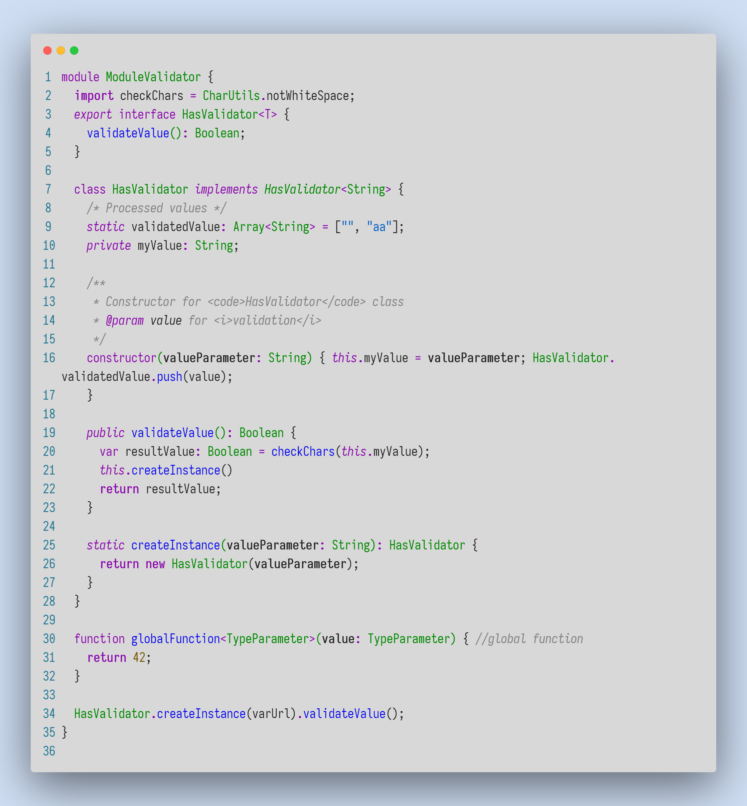
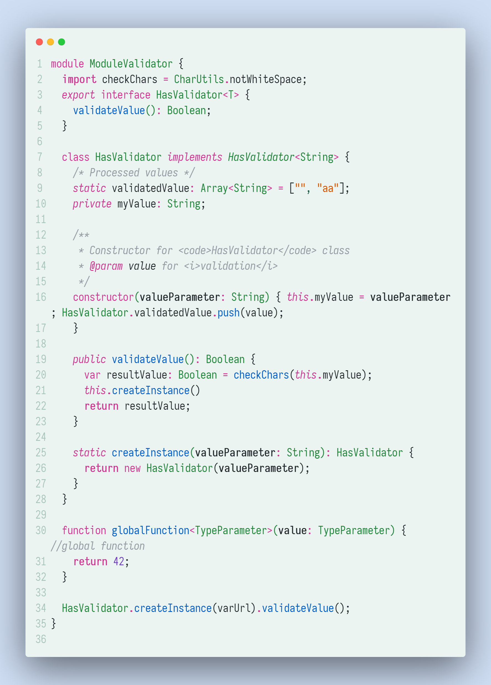

# README

VSCode Silver Gray Theme

**More new themes!**

Silver Primer Theme, Redefined workbench colors

Silver Dark Theme

Silver Yarra Theme

## Screenshots

<!-- Silver Gray Theme

Silver Dark Theme

Silver Yarra Theme

Silver Primer Theme

 -->

Silver Gray Syntax Color

Silver Primer Syntax Color

Silver Dark Syntax Color

Silver Yarra Syntax Color

## References

[Primer]

[One Dark]

[Noctis]

[New Moon]

[Yarra Valley]

[Noctis]:https://marketplace.visualstudio.com/items?itemName=liviuschera.noctis

[Tokyo Night]:https://marketplace.visualstudio.com/items?itemName=enkia.tokyo-night

[Gray Gray Gray]:https://marketplace.visualstudio.com/items?itemName=kendama1980.graygraygray

[Primer]:https://primer.style/primitives/

[Github Light]:https://marketplace.visualstudio.com/items?itemName=Hyzeta.vscode-theme-github-light

[Yarra Valley]:https://marketplace.visualstudio.com/items?itemName=dustypomerleau.yarra-valley

[New Moon]:https://marketplace.visualstudio.com/items?itemName=taniarascia.new-moon-vscode

[An Old Hope]:https://marketplace.visualstudio.com/items?itemName=dustinsanders.an-old-hope-theme-vscode

[One Dark]:https://github.com/joshdick/onedark.vim/blob/main/colors/onedark.vim